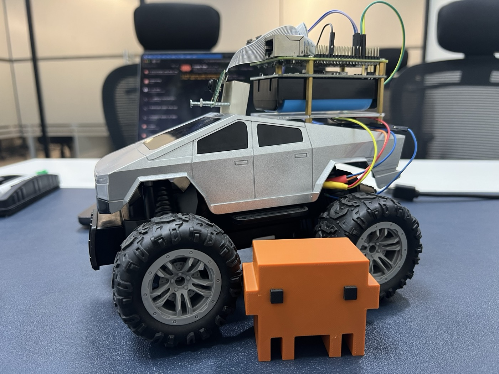

# I Gave Claude a Body

A talk from the Claude Code Meetup in Pune, 29 August 2026, by Varun Srinivas (CTO & Chief AI Officer, Coditas).

Over one weekend I put Claude Code on a Raspberry Pi bolted to a toy car and let it drive. The talk uses that build to show the five things that turn Claude Code from a chat window into something that does work for you:

1. **A place** — it runs on your machine, in a real folder, on real files.
2. **Rules** — everything that's true about your world, written down once, in `CLAUDE.md`.
3. **Hands** — tools it can call itself, over MCP, so it acts instead of explaining.
4. **Limits** — permissions that say what it may do on its own.
5. **Shortcuts** — slash commands and skills for anything you've done twice.

Most people only use the first one. The second half of the talk drops the car and runs the same five steps over a folder of medical records, to show none of this is about robots.

## The rover, driving

<video src="https://github.com/varun1505/i-gave-claude-a-body/raw/main/assets/rover-demo.mp4" poster="https://raw.githubusercontent.com/varun1505/i-gave-claude-a-body/main/assets/rover-demo-poster.jpg" controls muted playsinline width="100%"></video>

## Running the deck

Open `deck.html` in a browser. Arrow keys move between slides. Everything it needs is in `assets/`.

The demo video here is compressed for GitHub; the original is 1080p at a much higher bitrate.
